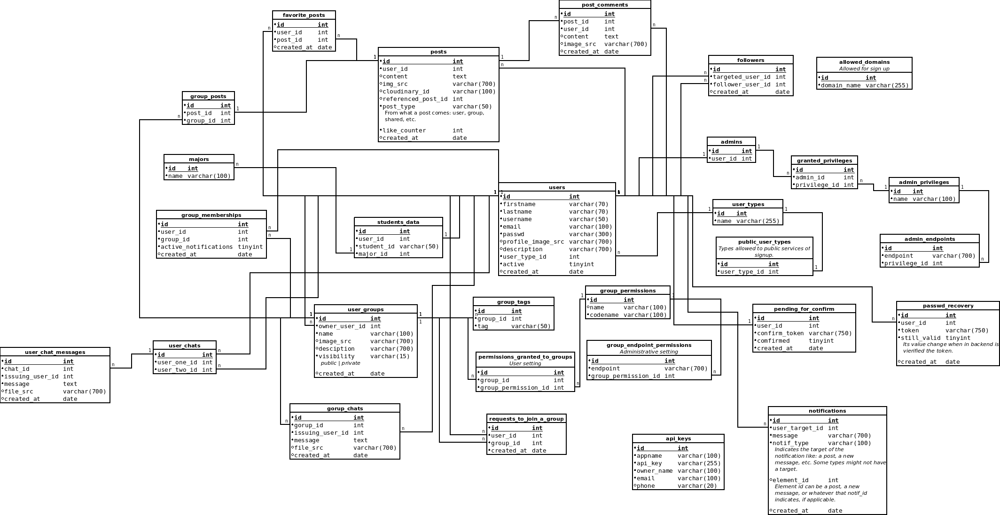

# SQL Database documentation

This system use MariaDB v10.4 as database management system.

## Index

* [SQL Schema](#SQL-Schema)
* [Stored procedures](#Stored-procedures)
  * [Create user](#Create-user)
  * [Create student](#Create-student)
  * [Create user type](#Create-user-type)
  * [Create an allowed domain](#Create-an-allowed-domain)
  * [Create an API key](#Create-an-API-key)
  * [Create group permission](#Create-group-permission)
  * [Create group](#Create-group)
  * [Add a permission to a group](#Add-a-permission-to-a-group)
  * [Add a tag to a group](#Add-a-tag-to-a-group)
  * [Switch group notifications](#Switch-group-notifications)
  * [Add a user to a group](#add-a-user-to-a-group)

## SQL Schema

## Stored procedures

SPs aid to perform complex process that require execute several queries and checks that must act as
a single one logic query. This approach is used to reduce the execution time when a service is called
at the backend.

All SPs which aim is modify in some way the database will return an exit code. 0 code is considered success.

SPs that modify the DB are write-type. SPs that only read data are read-type.

### Create user

#### Type

Write

#### Description

Creates a new base user in the system.

#### SP name

`sp_user_create`

#### Parameters

* `firstname`: varchar(70)
* `lastname`: varchar(70)
* `username`: varchar(50)
* `email`: varchar(100)
* `passwd`: varchar(300)
* `profile_img_src`: varchar(700)
* `description`: varchar(700)
* `user_type_id`: int unsigned
* `domain_name`: varchar(255)

#### Exit codes

* 1: Domain name not allowed.
* 2: Email already exists.
* 3: Username already exists.
* 4: User type id doesn't exist.

### Create student

#### Type

Write

#### Description

Creates a new student by an existing user.

#### SP name

`sp_create_student`

#### Parameters

* `user_id`: int unsigned
* `student_id`: varchar(50)
* `major_id`: int unsigned

#### Exit codes

* 1: User already registered as student.
* 2: User doesn't exist.
* 3: Major doesn't exist.

### Create user type

#### Type

Write

#### Description

Creates a new user type.

#### SP name

`sp_user_type_create`

#### Parameters

* `name`: varchar(255)

#### Exit codes

* 1: This name already exists.

### Create an allowed domain

#### Type

Write

#### Description

Creates a new allowed domain.

#### SP name

`sp_domain_create`

#### Parameters

* `domain_name`: varchar(255)

#### Exit codes

* 1: This domain name already exists.

### Create an API key

#### Type

Write

#### Description

Creates a new API key with the owner data related.

#### SP name

`sp_create_api_key`

#### Parameters

* `appname`: varchar(100)
* `owner_name`: varchar(100)
* `email`: varchar(100)
* `phone`: varchar(20)

#### Exit codes

* No codes.

### Create group permission

#### Type

Write

#### Description

Create a new group permission.

#### SP name

`group_permission_create`

#### Parameters

* `name`: varchar(100)
* `codename`: varchar(100)

#### Exit codes

* 1: Name already exists.
* 2: Codename already exists.

### Create group

#### Type

Write

#### Description

Creates a new group and register the membership of the owner user id with the new group id.

#### SP name

`group_create`

#### Parameters

* `user_id`: int unsigned
* `gname`: varchar(100)
* `image_src`: varchar(700)
* `description`: varchar(700)
* `visibility`: varchar(15)

#### Exit codes

* 1: User owner does not exist.
* 2: Visibility not allowed.

### Add a permission to a group

#### Type

Write

#### Description

Adds a permission to a group.

#### SP name

`group_grant_permission`

#### Parameters

* `group_id`: int unsigned
* `permission_id`: int unsigned

#### Exit codes

* 1: Permission does not exist.
* 2: Permission already granted.

### Add a tag to a group

#### Type

Write

#### Description

Adds a tag to a group.

#### SP name

`group_add_tag`

#### Parameters

* `group_id`: int unsigned
* `tag`: varchar(50)

#### Exit codes

* No codes.

### Switch group notifications

#### Type

Write

#### Description

Turn on or turn off the group notifications which the user requesting belongs to.

#### SP name

`group_switch_notifications`

#### Parameters

* `user_id`:` int unsigned
* `group_id`: int unsigned
* `state`: bool

#### Exit codes

* 1: User doesn't exist in the group memberships or the group doesn't exist.
* 2: Group notifications are already in that state.

### Add a user to a group

#### Type

Write

#### Description

Adds a user to a group.

#### SP name

`group_add_user`

#### Parameters

* `user_id`: int unsigned
* `group_id`: int unsigned

#### Exit codes

* 1: Group does not exist.
* 2: The user is already a member of the group.